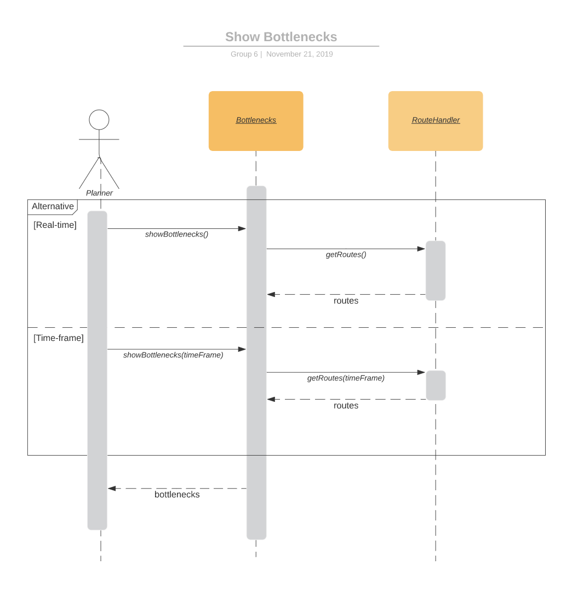

# DIT355 Mini Project: Distributed Systems Development
## Group 6
### Team Members:
* Talha Hussain
* Mujahid Khan
* Nicholas Fischer
* Ali Aziz
* Kent Edström
* Joakim Deak

### Program Management Report: 

***PRACTICES:***

The Team Worked in an agile fashion, implementing elements from Scrum.
The work was divided into Sprints, with a Sprint retrospective being held at the end of every Sprint.
Each Sprint lasted for about a week.
The team was divided into two groups, Group A **( Ali, Mujahid and Talha)** and Group B  **(Joakim, Kent and Nicholas)** 
Group A worked on the application portion of the system and Group B worked on the so called "backend"
The team was lead by a Scrum master who led every Sprint retrospective.
The team used Trello do document the progress and delegate the tasks. 

***SCOPE:***

Due a lack of resources and time, the team decided not to focus as much on the user expereince but intead decided to focus their efforts elswhere to key
aspects of the project such as the architectural styles which would ensure a minimal viable product.  

**Cost**

Although there were no monetary costs, the team did incur costs in the form of time spent on the project. As a result, the team had to use their time 
wisely to focus on key the primary functionality of the system.  

***FORCES AND DRIVERS:***

Usability: A big driver of the system is its usability. The system has to be able to smoothly and quickly provide blindspots and bottlenecks since these are
the main features of the actual application. Therefore the app needs to be easy to use and have a relatively small learning curve. This is so that
the users can quickly start working with the app instead of having to take a couple of days to learn how to use it. 

***SCHEDULE:***

For the scheduling the team decided that we should have flexible sprints. Some sprints might be a week long whilst other sprints might only last 
a couple of days. The structuring of the next sprint will be decided after each sprint has concluded. The lenght of a sprint will have many factors
based on what the team wants to accomplish that specific sprint. So for example some sprints might be a couple of days while others might be a week long. 
We believe that having short sprints several times during the week will improve on the communication that is required in the team. Short sprints will help
us make small changes each sprint so that all team members are always fully aware of what is going on during the project. The team will also have a
sprint planning at the start of each sprint and a conclusion meeting once the sprint is over to discuss the previous and future sprints. 

***SPRINTS:***

**Sprint 0**

The team started this sprint off with structuring both this sprint and the other upcoming sprints. 
We decided that at the start of each sprint a sprint planning was to be conducted. 
Each team member would be delegated a task to work on and that's how the structuring would be throughout the project.
Roles were also to be given to each team member. The role of Scrum Master would change each sprint so that each team member could get som experience in 
a leader type role. 

For this sprint the team was split into two groups. Group A **( Ali, Mujahid and Talha)** were tasked with creating the first draft of the software architecture
and the requirements and constraints. For sprint 0, the sequence diagram, the use case diagram and the component diagram were created. Tools were specified and
the requirements were created. 
Group B **(Joakim, Kent and Nicholas)** were tasked with setting up the broker and setting up the mock data generator. 

After every mandatory sprint retrospective. The team would have a separate meeting with just the team members. This meeting would be conducted
to discuss the previous sprint. Team members would be able to voice concerns and opinions. The upcoming sprint would also be discussed and once again
tasks would be delegated to each team member. During this phase, meetings during the sprint would also be planned.

**Sprint 1**

During the retrospective meeting in the previous sprint a decision was made by all the members that we should have the team split in two groups still so that
each group could work on different parts of the project. Although both groups had to have full knowledge about the other groups part. We decided that 
the groups should remain the same with the same members as the previous sprint. 

Group A would start to work on the route vizualisation app and group B would work on the the mock data generator and the Publish/Subscribe component.

Group A started with researching good UX and discussing the overall design and features of the app. Both teams worked closely together so that everyone had
some knowledge in all aspects of the project. 

Group B continued their work on the broker and the mock data generator. 

This sprint was mostly spent discussing how to go about the app and how to connect each part. Most of the time was spent researching and discussing how to 
implement the architecture.

**Sprint 2**

Group A spent this sprint prototyping the app and defining the responsibility of the classes in the app.

Group B worked on refining the publish and subscribe functionalities.

The entire team decided on which platforms would be supported by the system

**Sprint 3** 

Group A worked on transfering their code from GitHub to GitLab as well as implementing the MapBox SDK and API.  They also worked on the route, map and note
fragments of the app.

Group B focused on splitting up the publisher and subscriber components over multiple computers. They also began looking into the implementation of a 
pipe-and-filter architecture.

There was also a discussion amonst the whole team regarding the delegation of documentation tasks.

**Sprint 4**

During this sprint, the entire team planned for the first demo. This involved the entire team connecting to the Mqtt broker from multiple devices. 

Group A worked on creating bulk operations in the app as well as creating note popups in the app. They also worked on creating subscriber functionality
for the app so that it could subscribe to data from the Mqtt broker.

Group B worked on incorperating pipe and filter functionality to the backend code.  

**Sprint 5**

Group A worked on implementing a mock data generator for the app (used for testing purposes).  They also worked on route visualization, creating classes 
for requests, routes and stops as well as testing the visualization of upcoming routes using the MapBox Polyline feature.

Group B worked on generating more data for publishing and subscribing.  They also worked on generating random times when publishing data.  

The team also appointed Ali as the new scrum master.  

**Sprint 6** 

Group A worked on implementing the logic for bottleneck calculation.

Group B worked on updating the "backend" based on the updated requirements.

The entire team decided that a server component for sending requests from the app to backend would not be necessary.  Instead the backend would receive
requests from the the app through the MqttBroker.  

**Sprint 7**

Group A focused on researching and testing the Polyline feature on MapBox. They also implemented logic to filter stops according to the origin and 
destination and not just the whole vehicle journey.  They also worked on adding layers to the map and adding pan-app GSON deserialization implemation as 
well as code to support it

Group B worked implementing foult tolerance in the code and improving overall readibility.  

The entire worked on adding documentation to the README.md

**Sprint 8**

This was the last sprint of the project. The team started with having a final sprint planning to discuss the last parts of the project. During the discussion
the team decided that we need to improve on the documentation  since it was the part were we were least organized in.
We submitted the third retrospective after the sprint planning was done. 

Team A worked on implementing the logic for the blind spot calculation. Team A also worked on finalizing the app 

Team B worked on finalizing the backend code, removing all the unused code and adding more comments.

The entire team worked on finalizing the documentation.

### Requirements: 
**Functional Requirements**
1.	The system shall be able to visualize bottlenecks within public transport.
2.	The system shall be able to visualize blindspots of public transport within a specified region.
3.	The system shall be able to visualize route data 
4.	The system shall be able to receive route data from the user.

**Non Functional Requirements**
1.	The system shall update its visualization of the data within 5 seconds, 90% of the times.
2.	The system shall correctly handle unsupported data formats 95% of the time.

**Constraints** 
1.	The system shall use a middleware based on the MQTT protocol as the basis for 
distributed communication.
2.	 The system should advocate the concept of distribution transparency.

### Component Diagram:

In the business logic layer, DataGenerator is responsible for generating random routes.  The route data includes the coordinates, the time of departure,
purpose as well as the other required attributes.  The RoutHandler publishes the route data that the DataGenerator creates and publishes them to the 
MqttBroker.  At this point, the data is unflitered.

The Manager subscribes to the unfiltered route data and runs the data through the PipeAndFilter.  The PipeAndFilter filters the data based on the requested
user parameters.  These parameters include a requested timeframe as well as a requested purpose for traveling.

Once the data has been filtered, the Manager publishes the data to the broker where it is used by the App.

The manager also subscribes to data pertaining to the user's requested parameters.  These parameters are published to the broker from the application and
subscribed to by the manager.  The requested parameters (the timeframe and purpose) are passed into the PipeAndFilter along with the unfiltered data.  

### Sequence Diagram:

**Fault tolerance**

The Route Handler takes the routes that the Data Generates creates and publishes them to the Mqtt broker.  If the connection with the broker is lost, the 
Route Handler will try to reconnect.  Once the reconnection is established, it continues to run as before.  The Manager follows a similar procedure for 
fault tolerance.  If it is disconnected from the Mqtt Broker it will also attempt to reconnect and continue running as normal once the connection is 
re-established.
### Use case Diagram: 

### Deployment Diagram

The MqttBroker, the DataGenerator and DataHandler, and the Manager and PipeAndFilter do not need to run on seperate servers.  
They can all run on the same server but since they are distributed and connected through the MqttBroker, they can also run
on seperate servers
### Tool Specification: 

**Programming Languages** 
* **Python**: to set up the MQTT broker and client
* **Java**, **XML**: to develop frontend for the visualisation tool

**Framework/Technology**
* **MongoDB**: to store route data and other resources for future use 

**IDE**
* **Android Studio**: to create the frontend for the visualisation tool
* **Eclipse Paho**: to implement MQTT
* **Eclipse Mosquitto**: to implement MQTT
* **Pycharm**: to create backend for generating and publishing data 

**APIs**
* **Google Maps API**
* **Swedish Transport Administration Open API** 
* **https://www.trafiklab.se/api/trafikverket-oppet-api**

